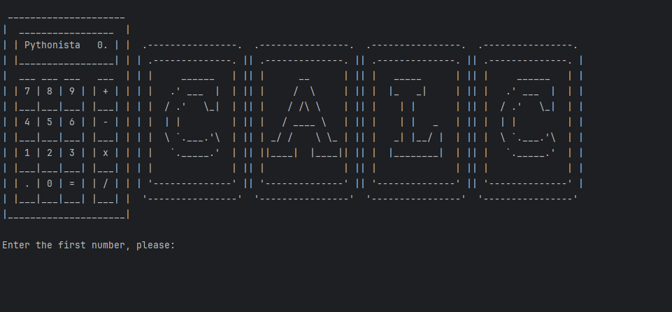

# Calculator Program

 

This is a simple Python calculator program that performs basic arithmetic operations: addition, subtraction, multiplication, and division. The program runs in the console and allows users to perform calculations continuously.

## Features

- Supports the following operations:
  - Addition (`+`)
  - Subtraction (`-`)
  - Multiplication (`*`)
  - Division (`/`)
- Allows chaining operations using the result of the previous calculation.
- User-friendly prompts to ensure valid input.

## Prerequisites

- Python 3.6 or later.
- The `art` module installed for displaying the program logo. You can install it using:

```bash
pip install art
